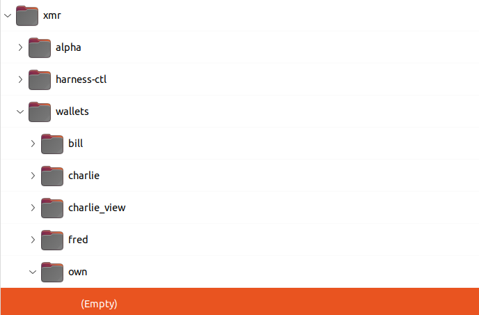
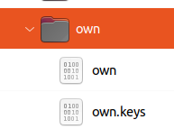

# Own Wallet Utilities

cmd/ownrpc/create_wallet

cmd/ownrpc/generate_wallet

cmd/ownrpc/go_fund_generated

cmd/ownrpc/use_generated

## Usage

Start the regtest harness. You should see a tree in ~/dextest/xmr

### Create Wallet

Creates a random wallet. Run to get a new wallet with new keys and a new primary address - if you do not have already.

When you have copied the primary address and keys **delete** the two created files.

### Generate Wallet

Generates a known wallet from it's Primary Address, Spend key and View key.

This time **do not delete!**

### Go Fund the Generated Wallet

Asks `bill` the harness miner to send a small amount of XMR to `own` wallet.

To make the money spendable go to the **harness** and `./mine-to-bill 11`

### Use Generated Wallet

Example usage of the generated wallet. Open, Refresh, GetBalance, Close.

To keep the transactions in the generated wallet on the chain start the harness daemon `alpha` with the `keep-fakechain` configuration option.
