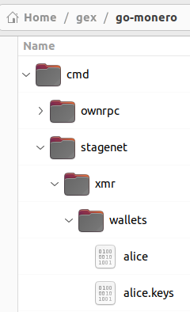

# Monero Stagenet Howto

## Usage

### Syncing

Run `./sync-stagenet.sh`

Currently about 1.67 Million Blocks.

When synced Ctl-c to exit.

### Running

Run `./start-stagenet.sh`

When finished use `./kill_daemons.sh` to exit.

### Generate a wallet

Build & run `gen_alice.go`

### Fund wallet

55ps81tfB2JTdbHXYVJuZVeYCYagjLjBPgHtH6DRHXZ3eMLLtE7FECTMmGzJmFVqPz75KsVcVdGMfe is **pre-funded**

but you can mine more ...

### Mine into wallet

export PATH to monerod.

`monerod --stagenet start_mining 55ps81tfB2JTdbHXYVJuZVeYCYagjLjBPgHtH6DRHXZ3eMLLtE7FECTMmGzJmFVqPz75KsVcVdGMfe`

heavy on the CPU!

`monerod --stagenet stop_mining`
