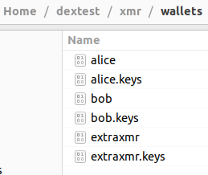

# Monero Stagenet Howto

## Usage

### Syncing

Run `./sync-stagenet.sh`

Currently about 1.67 Million Blocks.

When synced Ctl-c to exit.

### Running

Run `./start-stagenet.sh`

When finished use `./kill_daemons.sh` to exit.

### Generate a wallet

Build & run `gen_alice.go`

### Fund alice wallet

55ps81tfB2JTdbHXYVJuZVeYCYagjLjBPgHtH6DRHXZ3eMLLtE7FECTMmGzJmFVqPz75KsVcVdGMfe is **pre-funded**

but you can mine more ...

### Mine into wallet

export PATH to monerod.

`monerod --stagenet start_mining 55ps81tfB2JTdbHXYVJuZVeYCYagjLjBPgHtH6DRHXZ3eMLLtE7FECTMmGzJmFVqPz75KsVcVdGMfe`

heavy on the CPU!

`monerod --stagenet stop_mining`

## Added I

`xmrswap-stagenet.sh`

Starts 1 monerod and 3 rpc servers for bob, alice & extraxmr

`gen_bob`
`gen_extraxmr`

tool to create a known bob, extraxmr wallets from keys. extraxmr is not funded

So you can generate these with `generatefromkeys` in your own code

## Added II

Two scripts to run `monerod` and 3x `monero-wallet-rpc` wallet servers for dex testnet/stagenet PoC XMR Swap code.

- `xmrswap-stagenet-gen` run when generating wallets.
- `xmrswap-stagenet-run` run when using dex PoC XMR Swap codewith pre-generated wallets.

You can also fund the wallets after starting these scripts by mining on stagenet (see above) and mine many blocks fast as the `monerod` is started with the --fixed-difficulty 1 flag to enable this
